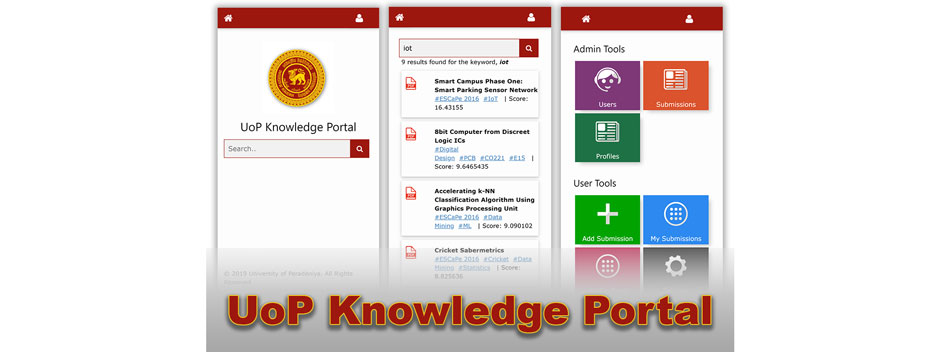

    

# Pera Knowledge Portal

## Team
-  E/15/140, Jaliyagoda A.J.N.M., [nuwanjaliyagoda@eng.pdn.ac.lk](mailto:nuwanjaliyagoda@eng.pdn.ac.lk)
-  E/15/173, Karunarathne S.D.D.D, [dinelkadilshani95@gmail.com](mailto:dinelkadilshani95@gmail.com)
-  E/15/350, Tennakoon T.M.P.B., [pasan96tennakoon@gmail.com](mailto:pasan96tennakoon@gmail.com)

---

## Introduction

Our project aims to create a database of Research papers, Project Reports, Thesis’ done in University of Peradeniya. Since there is no current database where we keep the project reports other than the hard copies themselves, it is not possible for a person outside the university to access these reports. We created a platform where anyone in the university can upload their respective reports into a database which can be used by anyone; inside or outside the university, to access and read through. Anyone who is a member of the University of Peradeniya can use the CMS platform we have created to register on Pera Knowledge Portal. Members of our website can upload a pdf document of the documentation (Research Paper, Project Report, Thesis) they wish to be published. Knowledge Portal platform extracts the texts from pdf documents and indexed them in our database. Which gives the documentation to be searched even by the content of pdf documents. Anyone inside or outside the university can use the search engine we have provided to search these documents. Pera knowledge Portal search engine is able to produce accurate search results and give the most relatable documents according to the search text by the user.

## Links

- [Project Repository](https://github.com/cepdnaclk/e15-co227-pera-knowledge-portal)
- [Project Page](https://cepdnaclk.github.io/e15-co227-pera-knowledge-portal/)
- [Department of Computer Engineering](http://www.ce.pdn.ac.lk/)
- [University of Peradeniya](https://eng.pdn.ac.lk/)

[//]: # (Please refer this to learn more about Markdown syntax)
[//]: # (https://github.com/adam-p/markdown-here/wiki/Markdown-Cheatsheet)
